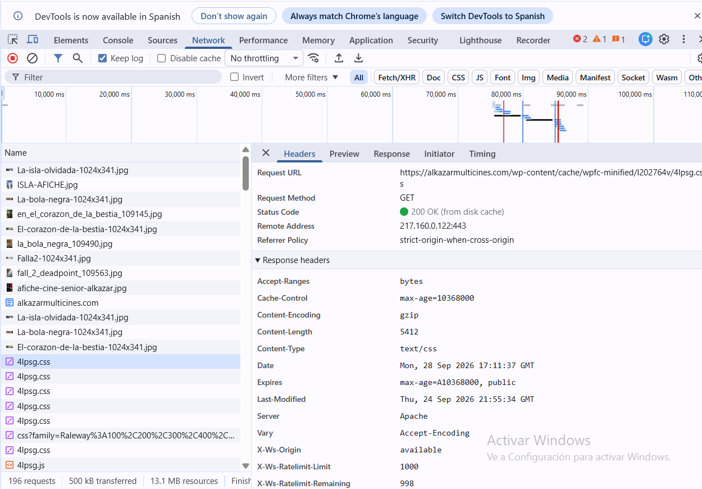
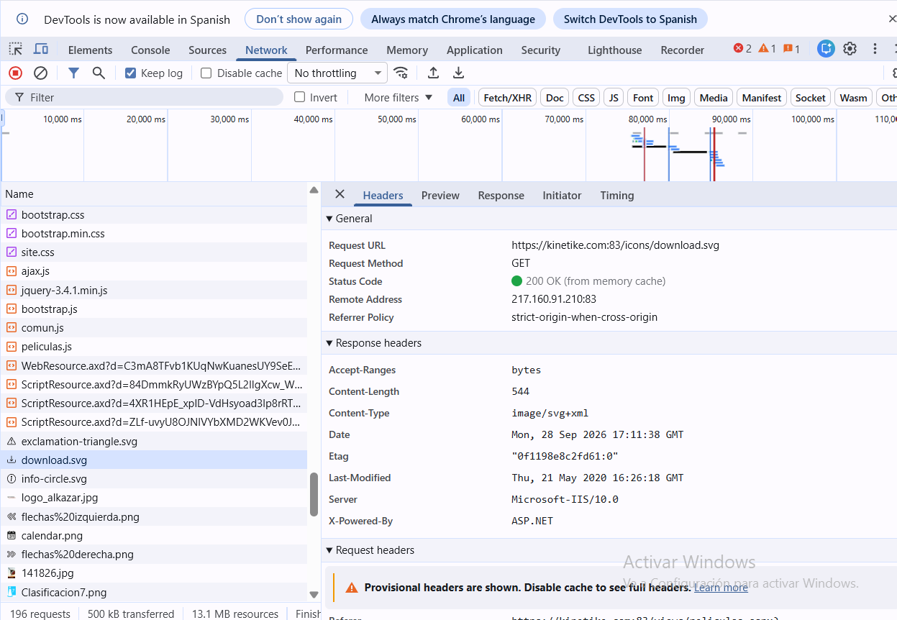

# Mini-Proyecto-T1

## Análisis de la web

La página (https://alkazarmulticines.com/) redirige a una página de Kinetike donde se puede consultar la cartelera de Cines Alkazar. En ella aparecen películas, salas y horarios. Al seleccionar una sesión, se inicia el proceso para elegir el número de entradas.

## ¿Qué partes son frontend?

El frontend es la parte que vemos y usamos desde el navegador. En esta web incluye:

- La cartelera con los títulos de las películas, su duración y clasificación por edades.
- La información de las salas y los horarios disponibles.
- Los enlaces y controles que permiten seleccionar una sesión y continuar con la compra.
- Las imágenes y el diseño que organizan esa información en pantalla.

Por ejemplo, al pulsar un horario, el navegador envía datos de la sesión seleccionada, como la película, el cine, la fecha, la hora y la sala.

## ¿Qué partes son backend?

El backend es la parte que trabaja en el servidor y que normalmente no vemos directamente. En una web de cartelera y entradas, se encarga de tareas como:

- Obtener y preparar la información de películas, salas y horarios para mostrarla.
- Recibir la sesión que ha elegido el cliente y continuar el proceso de reserva.
- Comprobar los datos de la compra y, según el funcionamiento del servicio, gestionar la disponibilidad y las entradas.

La página consultada usa direcciones `.aspx` y acciones `WebForm` para continuar desde un horario. Esto sugiere que parte de la web se procesa en el servidor, pero desde fuera no se puede confirmar cómo está programado todo el backend ni qué base de datos utiliza.

* `WebForm` formulario que aparece en una página de Internet para que puedas introducir y enviar información.
* `.aspx` es una extensión que indica que una página web está hecha con tecnología ASP.NET.(Microsoft)

## Modelo cliente-servidor 

El cliente es el navegador de la persona que visita la web. El servidor es el ordenador del servicio que responde a las solicitudes.

1. El navegador solicita la página de Cines Alkazar al servidor.
2. El servidor responde con la cartelera y el navegador la muestra. Esa parte visible es el frontend.
3. La persona elige una película y un horario. El navegador envía esa selección al servidor.
4. El servidor recibe la solicitud, procesa los datos y responde con el siguiente paso, como la pantalla para elegir entradas.
5. El navegador muestra esa respuesta y la persona puede continuar con la compra.

